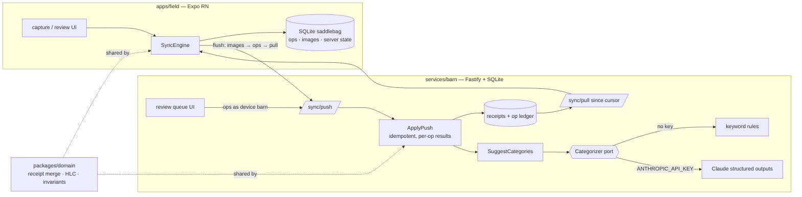

# 🐴 saddlebag

**Offline-first field expense capture for farms and ranches.** Snap a receipt in
a cellular dead zone; it rides home in the saddlebag and books itself when the
signal returns — AI proposes the Schedule F line, a person approves it.

Rural reality: the place where farm money gets spent (the co-op, the north
pasture, the sale barn) is exactly where connectivity is worst. Most
bookkeeping apps treat the network as part of the write path, so the receipt
waits in a shoebox until winter. Saddlebag treats the network as an
optimization: **every write lands in on-device SQLite first**, and a sync
engine drives the queue to the server whenever it can.

```
— 7:40 AM, north pasture. No bars on the phone. Three receipts get captured anyway:
   · CAPTURED  Cenex Co-op         $312.55   [1 op(s) in the saddlebag]
   · CAPTURED  Tractor Supply Co   $184.37   [1 op(s) in the saddlebag]
   · CAPTURED  Valley Vet Supply    $96.20   [1 op(s) in the saddlebag]

— 12:15 PM, back in cell range. The saddlebag unloads:
   ⇄ flush: 1 image(s) up, 3 op(s) applied, 0 duplicate(s), 0 rejected, 3 receipt(s) pulled
   · SUGGESTED Cenex Co-op         $312.55
       🤖 suggests 19 · Gasoline, fuel, and oil (60%) — Rule match on "Cenex"…

— …and when two writers touch the same field while apart:
   · SUGGESTED Tractor Supply Co   $184.37   32 · Other expenses
       ⚡ conflict on category: kept "F32", dropped "F28" from phone-in-the-truck
```

That transcript is real — `pnpm demo` replays it end-to-end over HTTP against
an in-process server.

## What's inside

| Piece | What it demonstrates |
|---|---|
| `packages/domain` | Pure TypeScript, **zero runtime dependencies**: the receipt aggregate, hybrid logical clocks, field-level last-writer-wins merge with a conflict audit log, ports. |
| `packages/contracts` | The wire protocol as zod schemas — shape validation at the edge, semantic validation in the domain. |
| `packages/sync` | The shared sync layer: the outbox engine every client runs (phone, laptop, tests) and the codec both sides of the wire use. |
| `services/barn` | The sync target: idempotent op application, the AI categorizer behind a port (keyword rules or Claude), a review-queue web UI. |
| `apps/field` | Expo / React Native app: capture form, SQLite saddlebag, connectivity-aware auto-sync, approval cards. |
| `tools/field-sim` | Headless narrated demo of the whole story — also the fastest way to *see* the protocol behave. |

## Design decisions worth interrogating

**Sync is op-based, not state-based.** A device queues intent (`capture`,
`patch`, `approve`) with client ids. The server dedupes on op id and the merge
itself is a fixpoint, so at-least-once delivery yields exactly-once effects —
losing a response mid-flush is safe, retrying is safe, replaying is safe. One
integration test literally replays a "lost response" push and asserts nothing
changes.

**Merges are per-field, decided by hybrid logical clocks.** Whole-record
last-writer-wins throws away work; per-field HLC-ordered writes mean the
office editing a memo never collides with the field fixing an amount. When two
writers *do* touch the same field while apart, the later stamp wins and the
loser is written to a **conflict log on the receipt** — arbitrated, surfaced,
never silently dropped. Pulled stamps fold into the local clock, so a phone
with a slow clock still wins the next edit it makes after syncing.

**The AI defers to people, by construction.** The categorizer only ever
*proposes* a Schedule F line; a human approves it. Extracted facts (vendor,
total, date) fill fields that are still empty — and those fills are stamped at
wall-clock **zero** from a reserved writer id, so any human write, even one
made offline *before* the fill happened, outranks them silently. "Never
overwrite a person" is a domain invariant with a unit test, not server
etiquette.

**Approval pins what the person saw.** If a concurrent edit changed the
category before an offline approval synced, the approval doesn't stick — the
disagreement lands in the conflict log for re-review instead of booking a
category nobody chose.

**One write path.** The barn's review web UI doesn't get privileged
endpoints — it pushes ops through `POST /sync/push` as device `"barn"`,
exactly like the phones. Every writer is a sync client; the merge rules are
the single source of truth.

## Architecture



The merge function that resolves an edit on the phone is the same code that
resolves it on the server — one domain package, imported by both sides.

## Run it

Requires node ≥ 22 and pnpm.

```bash
pnpm install
pnpm test        # 45 tests: domain merge semantics, engine, live HTTP protocol
pnpm demo        # the narrated end-to-end story above
pnpm dev         # barn on :4477 — review queue at http://localhost:4477
```

**The phone app** (requires Xcode or Android tooling):

```bash
cd apps/field
pnpm ios         # or: pnpm android
```

The dead-zone demo script: stash a receipt → flip on Airplane Mode → stash two
more (note the 🎒 queue badge) → flip it off → watch the flush, the 🤖
suggestions, and approve from the phone while the barn's review page mirrors
it live. On a physical phone, point the `barn` field at your laptop's LAN IP.

### AI categorization

With no configuration the barn uses deterministic keyword rules — the demo
works offline-from-Anthropic too. Set `ANTHROPIC_API_KEY` and it switches to
Claude (`claude-opus-5`) reading the actual receipt photo via structured
outputs: vendor, total, date, line, confidence, and a one-line rationale a
rancher can sanity-check.

```bash
cp services/barn/.env.example services/barn/.env   # put your key here (gitignored)
pnpm --filter @saddlebag/barn smoke:claude         # one-shot categorizer check
```

| Env var | Default | Meaning |
|---|---|---|
| `PORT` | `4477` | barn HTTP port |
| `BARN_DB` / `BARN_BLOBS` | `data/…` | ledger + receipt photos |
| `SADDLEBAG_CATEGORIZER` | auto | `claude` or `rules` (auto: claude iff key set) |
| `SADDLEBAG_CLAUDE_MODEL` | `claude-opus-5` | model override |

## Hosting the barn (optional)

The barn is a stateful long-running server (SQLite + image files on disk), so
serverless platforms like Vercel are the wrong shape for it — use any host
that runs a Docker container with a persistent volume. The included
`Dockerfile` expects the volume at `/data`. On Railway:

1. New Project → Deploy from GitHub repo (the Dockerfile is auto-detected).
2. Add a **Volume** mounted at `/data`.
3. Settings → Networking → Generate Domain, target port `4477`.
4. Optionally set `ANTHROPIC_API_KEY` to enable Claude categorization.

> **Before setting the key on a public deployment:** the demo has no auth, so
> a public barn with a key lets anyone on the internet spend your API
> credits. For an always-up public link, leave the key off (rules mode);
> switch Claude on only while demoing live.

Phones then point their in-app `barn` field at the public URL.

## Honest limitations

Scoped as a demonstration, deliberately:

- Single tenant, no auth — a real barn fronts this with identity and per-farm scoping.
- Categorization runs inline after each push; production wants a queue and a
  retry policy (the use case already isolates failures per receipt).
- Images ride as base64 JSON — fine for receipts, wrong for scale; the blob
  store is a port so the swap is contained.
- Conflict log is capped at the last 20 entries per receipt; an audit-grade
  system would append to an immutable log instead.
- The Expo app typechecks and the engine under it is fully tested, but this
  machine has no Xcode, so the UI hasn't been driven in a simulator here —
  `pnpm ios` is the first thing to run on a machine that has one.
